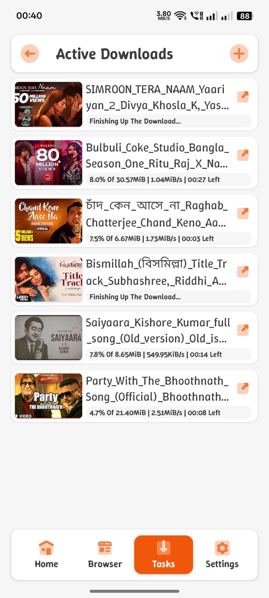
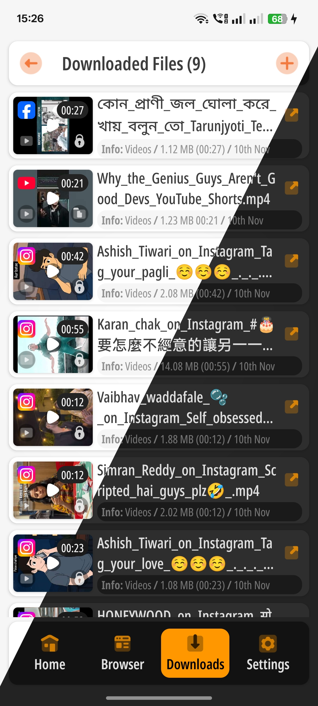
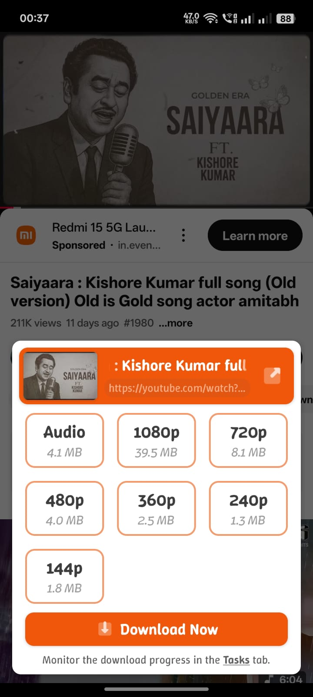

# AIO Video Downloader

### 📥 Simple Yet Powerful Video Player & Downloader for Android — Free, Open Source, and Built with Speed, Privacy, and Flexibility in Mind

----

---

## 📌 Introduction

**AIO Video Downloader** is a simple yet **full-featured video player and downloader** for Android — built for speed, privacy, and efficiency.  
Powered by the robust **[yt-dlp](https://github.com/yt-dlp/yt-dlp)** backend (via [youtubedl-android](https://github.com/yausername/youtubedl-android)), it can grab and download **almost any video that plays online**, supporting **over 1000 websites**.

Unlike bloated alternatives filled with ads or restrictions, AIO is completely **ad-free**, **open-source**, and designed for users who value performance, transparency, and control.

It’s not just a downloader — it’s your **private media center** with built-in file locking, fast background downloads, and a powerful integrated video player.

---

## ⚡ What Makes It Special

- **Super Fast Downloads** – Optimized connection handling for maximum speed
- **Grab Almost Any Video** – Works on 1000+ websites thanks to yt-dlp integration
- **Private File Lock** – Keep sensitive videos and downloads hidden and secure
- **Full-Feature Video Player** – Smooth playback with gesture controls and background play
- **Smart Download Manager** – Pause, resume, reorder, or delete downloads easily
- **Adaptive Streaming Support** – Seamless playback for multi-quality video sources
- **Audio Normalization** – Keeps your sound levels consistent across media
- **Modern UI with Dark Mode** – Sleek interface that adapts to your theme
- **Completely Ad-Free** – No trackers, no popups, no nonsense
- **Lightweight and Stable** – Designed to perform smoothly even on older devices
- **Open Source** – 100% transparent code; community-driven and auditable

---

## 📱 Screenshots

---

## 🚀 Key Features Summary

- 🔗 **1000+ Website Support** – Download from nearly any platform
- 🎥 **Built-in Video Player** – Full playback control, gesture support, and background play
- 🔒 **Private File Lock** – Secure access to personal or private downloads
- ⚙️ **Smart Download Engine** – Parallel threads, resume support, and adaptive retries
- 🎧 **Audio Extraction** – Convert video to MP3 or M4A directly
- 💡 **Simple Yet Powerful UI** – Focused on usability and efficiency
- 🌙 **Dark Mode** – Easy on the eyes and battery-friendly
- 🧭 **In-App Browser** – Browse and download without switching apps
- 📂 **Download Organizer** – Sort, rename, or share your media effortlessly
- 🇮🇳 **Made with ❤️ in India** – Built proudly by independent developers

---

## 🧩 Tech Stack

- **Kotlin + Jetpack Components**
- **ExoPlayer** for advanced media playback
- **yt-dlp + youtubedl-android** for multi-site extraction
- **Foreground Service Architecture** for stable background downloads

---

## ⚠️ Note

AIO Video Downloader is not affiliated with **VidMate**, **SnapTube**, or any other proprietary downloader.  
It’s a **community-driven, non-commercial** project built to keep the web open and accessible.

---

**Made with ❤️ in India** 🇮🇳  
Open source. Ad-free. Forever.
