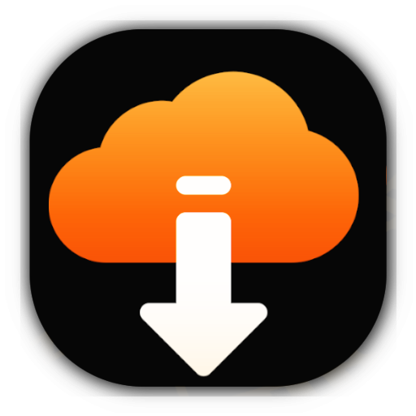
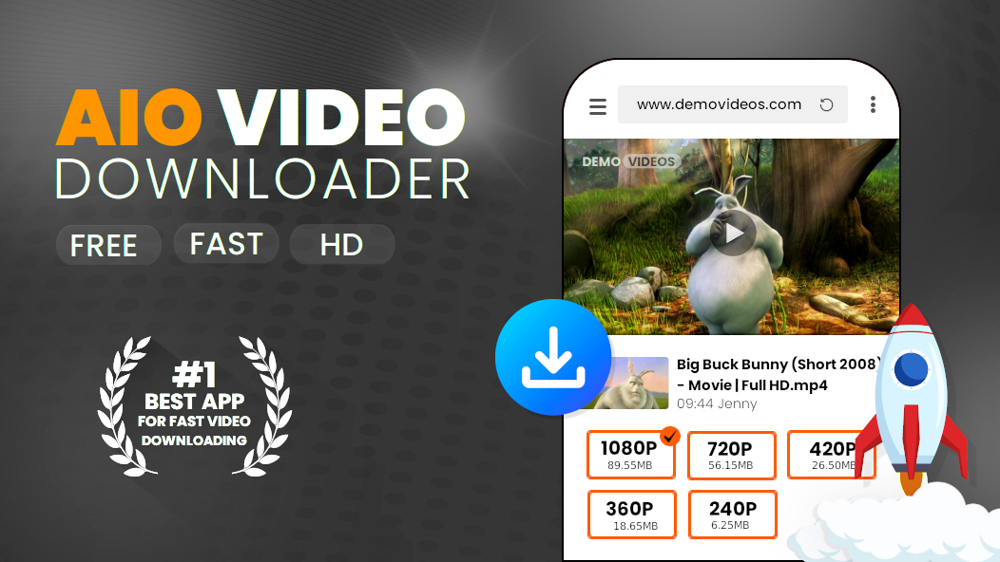

# AIO Video Downloader
### 🚀 Premium All-in-One Media Hub for Android

**Download • Play • Protect • Simple • Fast • Private**

    

---

## 🌐 Visit the Official Site
For the latest news, detailed guides, and direct APK mirrors, visit our official landing page:
### 👉 **[YTDER.COM](https://ytder.com)**

---

## 📌 Introduction

**AIO Video Downloader** is your ultimate all-in-one media companion for Android. It combines a professional-grade video downloader, a high-fidelity media player, and a secure private vault into one elegant, ad-free package.

Built on the robust **[yt-dlp](https://github.com/yt-dlp/yt-dlp)** engine, AIO delivers industry-leading speeds and supports **1000+ websites**, including YouTube, Instagram, Facebook, TikTok, and Twitter.

---

## 📱 App Highlights

    
    
    

### ⚡ **Super-Fast Extraction**
- **yt-dlp Integration**: The most powerful engine for video grabbing.
- **Multi-Threaded**: Optimized for maximum bandwidth usage.
- **4K Support**: Download in resolutions from 144p up to 4K (Ultra HD).

### 🎬 **HD Media Player**
- **Native Playback**: Supports MP4, MKV, AVI, WebM, and more.
- **Gesture Control**: Intuitive swipes for brightness, volume, and seeking.
- **Audio Extraction**: Save and play videos as high-quality MP3s.

### 🔒 **Private Vault**
- **Hidden Storage**: Move sensitive downloads to a secure, app-locked folder.
- **Gallery Stealth**: Files in the vault are invisible to the rest of your phone.

---

## 🏆 Why AIO is Better

| Feature | AIO Video Downloader | Snaptube / Vidmate |
| :--- | :---: | :---: |
| **Advertisements** | ❌ **None** | ⚠️ Heavy & Invasive |
| **Open Source** | ✅ **Yes** | ❌ No (Proprietary) |
| **Privacy** | 🛡️ **High** | 📉 Low (Tracking) |
| **Engine** | 💎 **yt-dlp** | Closed-Source |
| **Private Folder** | ✅ **Yes** | ❌ Limited |

---

## 🚀 How to Install

1.  **Download**: Head to **[ytder.com](https://ytder.com)** or the [GitHub Releases](https://github.com/shibaFoss/AIO-Video-Downloader/releases/latest/) page.
2.  **Install**: Open the APK file (Ensure "Install from Unknown Sources" is enabled in settings).
3.  **Enjoy**: Start downloading and playing your favorite media instantly!

## 🔧 Technical Details

- **Language**: Kotlin / Material Design 3
- **Minimum OS**: Android 8.0 (Oreo) or higher
- **Architecture**: arm64-v8a, armeabi-v7a, x86_64

---

**Made with ❤️ in India** 🇮🇳

*AIO Video Downloader is an independent project. We believe in software that respects user privacy and freedom. Visit us at [ytder.com](https://ytder.com).*

