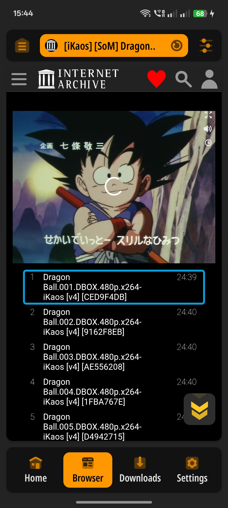
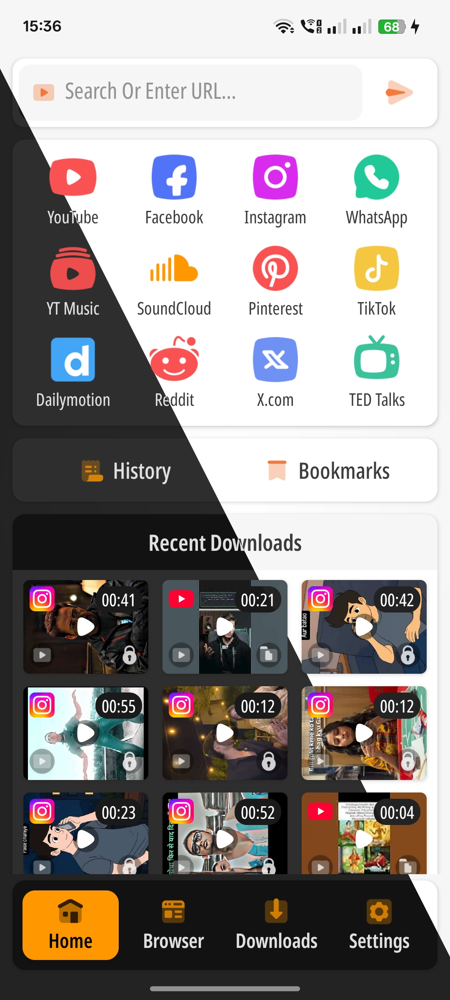
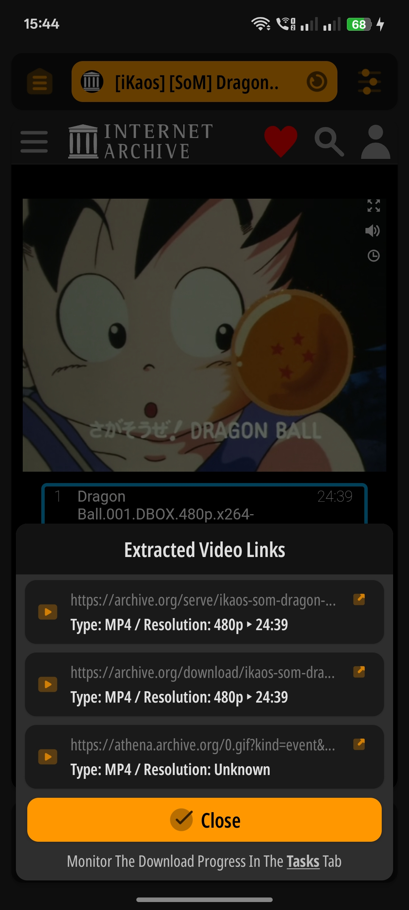

# AIO Video Downloader (AIO वीडियो डाउनलोडर)

### 🚀 ऑल-इन-वन वीडियो समाधान: डाउनलोड करें, चलाएं और सुरक्षित रखें - सरल, तेज़ और निजी

----

  <a href="#-परिचय">परिचय</a> •
  <a href="#-मुख्य-विशेषताएं">विशेषताएं</a> •
  <a href="#-स्क्रीनशॉट्स">स्क्रीनशॉट्स</a> •
  <a href="#-टेक-स्टैक-और-आर्किटेक्चर">आर्किटेक्चर</a> •
  <a href="#-कोर-टीम-से-जुड़ें">योगदान</a>

  
🌐 <b>भाषा चुनें (Select Language)</b>

  

    <a href="../README.md">English</a> | 
    <a href="README_ZH.md">简体中文</a> | 
    <a href="README_HI.md">हिन्दी</a> | 
    <a href="README_ES.md">Español</a> | 
    <a href="README_FR.md">Français</a> | 
    <a href="README_ID.md">Bahasa Indonesia</a> | 
    <a href="README_RU.md">Русский</a> | 
    <a href="README_VI.md">Tiếng Việt</a>
  

 

---

## 📌 परिचय

**AIO Video Downloader** Android के लिए एक हाई-परफॉर्मेंस मीडिया साथी है। यह एक शक्तिशाली डाउनलोडिंग इंजन, फीचर-रिच वीडियो प्लेयर और एक सुरक्षित प्राइवेट वॉल्ट (Vault) को एक सरल और शानदार ऐप में जोड़ता है।

यह मजबूत **[yt-dlp](https://github.com/yt-dlp/yt-dlp)** कोर पर आधारित है, जो अधिकतम गति के लिए ऑप्टिमाइज्ड पैरेलल कनेक्शन के साथ **1000+ वेबसाइटों** का समर्थन करता है।

---

## 🤝 कोर टीम से जुड़ें (मेंटेनर्स की ज़रूरत है)

हम AIO के तकनीकी भविष्य को बेहतर बनाने के लिए **प्रोजेक्ट मेंटेनर्स (Project Maintainers)** की तलाश कर रहे हैं। अगर आप एक डेवलपर हैं और एक मॉड्यूलर, क्लीन Kotlin प्रोजेक्ट में योगदान देना चाहते हैं, तो हमें आपकी ज़रूरत है।

### 🛠 आप कैसे मदद कर सकते हैं:
* **कोर मेंटेनेंस:** इंडिपेंडेंट मॉड्यूल्स और इंजन परफॉर्मेंस को ऑप्टिमाइज करना।
* **एक्सट्रैक्शन स्पेशलिस्ट:** `yt-dlp` और `NewPipe Extractor` के इंटीग्रेशन को बेहतर बनाना।
* **UI/UX डेवलपमेंट:** हमारे कस्टम-थीम वाले, परफॉर्मेंस-ओरिएंटेड इंटरफ़ेस को विकसित करना।
* **कोड क्वालिटी:** PRs रिव्यू करना और मेन ब्रांच की स्टेबिलिटी बनाए रखना।

### 💻 टेक स्टैक और आर्किटेक्चर
* **भाषा (Language):** 100% Kotlin
* **आर्किटेक्चर:** मॉड्युलर MVVM (सख्त सेपरेशन ऑफ कंसर्न के साथ):
  * **इंडिपेंडेंट मॉड्यूल्स:** कोर लॉजिक UI से पूरी तरह अलग (Decoupled) है।
  * **डेटा और मॉडल लेयर:** मेटाडेटा हैंडलिंग और फाइल स्टेट मैनेजमेंट के लिए मजबूत ढांचा।
  * **कस्टम UI:** परफॉर्मेंस के लिए ऑप्टिमाइज्ड कस्टम थीम (यह पूरी तरह मटेरियल डिज़ाइन गाइडलइन्स का पालन नहीं करता)।
* **मुख्य इंजन (Primary Engines):**
  * [ytdlp-android-wrapper](https://github.com/yausername/youtubedl-android)
  * [NewPipe Extractor](https://github.com/TeamNewPipe/NewPipeExtractor)

> **रुचि रखते हैं?** ऑनबोर्डिंग पर चर्चा करने के लिए कृपया `[Maintainer]` टैग के साथ एक [New Issue](https://github.com/shibaFoss/AIO-Video-Downloader/issues) खोलें।

---

## ✨ मुख्य विशेषताएं

* 🎯 **सरल और सहज:** वन-टैप डाउनलोड और स्मार्ट कंटेंट डिटेक्शन।
* ⚡ **सुपरचार्ज्ड स्पीड:** मल्टी-कनेक्शन डाउनलोड और बैकग्राउंड प्रोसेसिंग।
* 🎬 **पावरफुल प्लेयर:** HW एक्सेलेरेशन, सबटाइटल सपोर्ट और बैकग्राउंड प्लेबैक।
* 🔒 **प्राइवेट वॉल्ट:** संवेदनशील मीडिया के लिए सुरक्षित, ऐप-लॉक्ड स्टोरेज।
* 🌐 **यूनिवर्सल सपोर्ट:** इन-बिल्ट सुरक्षित ब्राउज़र के ज़रिए 1000+ साइटों पर काम करता है।
* 🛡️ **एड-फ्री और ओपन सोर्स:** पारदर्शी, सुरक्षित और आपकी प्राइवेसी का सम्मान करने वाला।

---

## 📱 स्क्रीनशॉट्स

  
  
  
   
  
  
  

---

## 🚀 शुरुआत कैसे करें

1.  **URL पेस्ट करें:** कोई भी वीडियो लिंक कॉपी करें या इन-ऐप ब्राउज़र का उपयोग करें।
2.  **ऑटो-डिटेक्ट:** ऐप अपने आप हाई-क्वालिटी स्ट्रीम ढूंढ लेगा।
3.  **चुनें और डाउनलोड करें:** अपना रेजोल्यूशन (4K तक) चुनें और डाउनलोड करें।
4.  **सुरक्षित करें:** गैलरी से छिपाने के लिए डाउनलोड की गई फाइलों को **प्राइवेट फोल्डर** में ले जाएं।

---

## 🔧 तकनीकी विनिर्देश (Technical Specifications)

* **प्लेटफ़ॉर्म:** Android 8.0+ (API 26)
* **इंजन:** yt-dlp / youtubedl-android
* **भाषा:** Kotlin
* **लाइसेंस:** कस्टम ओपन सोर्स लाइसेंस

---

  <b>भारत में ❤️ के साथ निर्मित 🇮🇳</b>
   
  <i>गोपनीयता का सम्मान • पारदर्शिता को बढ़ावा</i>

